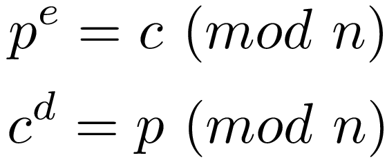
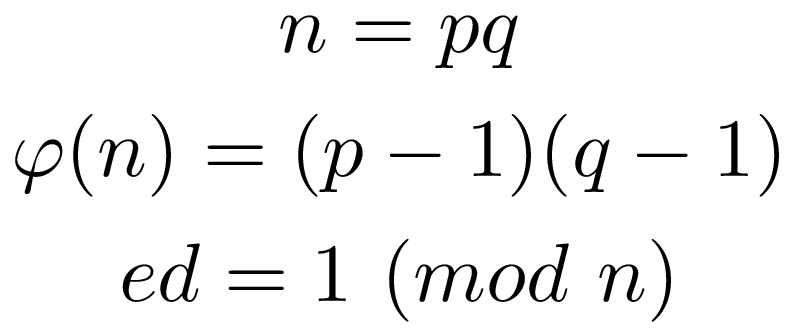
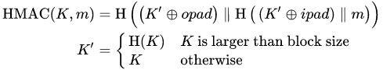

# Cryptology
Cryptology, or cryptography, is the study of techniques that secure communication. In order to assure secure communications, there are three components required: **confidentiality**, **integrity**, and **availability**: 
* **Confidentiality** means that keeping or being kept secret or private. In secure communication, it means that the information is only viewable to the authenticated persons.\
Confidentiality is usually provided by encrypting the message with a cipher.

* **Integrity** means the quality of being honest and unified as a whole. In secure communication, it means that the authenticity of the given component is always true. In another word, we are always talking to someone who we expected, and the received message is always what the sender meant.\
Unlike confidentiality, integrity is not provided by cipher. We need to use something called **cryptographic hash function** to help us achieve this requirement.

* **Availability** means the quality of being able to be used or obtained. In secure communication, it means that the system should be always usable, which often means it sends message at real time.\
Availability is usually provided by the architecture of the secure communication system, which we do not covered.

In this project (more like codes for fun lol), I want to show some modern cryptologies as well as some techniques which helps in achieving online secure communications nowadays. I recommend using Java for this project and cryptology related stuff because Java has the most up-to-date cryptology libraries.

**I hope you guys enjoy it!**

## List of Topics:
* Classical Ciphers:
   * [Caesar](#caesar-cipher)
   * Affine
   * Vigenere
* Symmetric Ciphers:
   * DES / AES
* Asymmetric Ciphers:
   * RSA
   * Chinese Remainder Theorem
   * Miller-Rabin Primality Test
* Cryptological Hash Fucntions and Applications:
   * Signature
   * [MAC/HMAC](#MAC/HMAC)

## Classical Ciphers
### Caesar Cipher
Caesar cipher is a stream, mono-alphabetic cipher with substitution. The way Caesar Cipher works is by shifting the alphabet down with a fix amount. To decrypt a Caesar cipher, ones can simply shift up the same amount, which is equivalent to shifting down the complement amount in the domain.
* Key: The shifting amount, an integer
* Encryption: `(plain_text + shift) % domain_size = cipher_text`
* Decryption: `(cipher_text + domain_size - shift) % domain_size = plain_text`

### Affine Cipher
Affine cipher is a stream, mono-alphabetic cipher with substitution. The way Affine Cipher works is similar to Caesar cipher, the different is that the shift amount will be determined by a linear equation instead of a number.
* Key: Two integers **a** and **b**, as the coefficients for a linear equation
* Note: Coefficient **a** needs to be co-prime with the domain size (why?)
* Encryption: `(a * plain_text + b) % domain_size = cipher_text`
* Decryption: `((cipher_text - b) / a) % domain_size = plain_text`

###  Vigenere cipher
Vigenere  cipher  is  a  block,  poly-alphabectic  cipher  with  substitution. The three introduced classical ciphers are all about substitutions with different functions to determine the shift amount. For Vigenere  cipher, it is basically a Caesar cipher with the shift amount  determined by a key, which contains the shift amount for a block of text and it is usually an English word.
* Key: an array of shift amount, i.e. an English word

## Symmetric Ciphers
### DES / AES
DES stands for Data Encryption Standard. It  is  a  block, poly-alphabetic cipher and  it  is  the most  common  method for encrypting static information nowadays. AES is  very  similar to DES except  it  has  a bigger block size than 64  bits.

## Asymmetric Ciphers
### RSA
RSA stands for Rivest–Shamir–Adleman, which is an asymmetric cipher based on the computational difficulty of factoring a large number. Asymmetric cipher is crucial for modern Internet communications because it allows people to have confidentiality without prior meeting.
RSA algorithm consist of three components, a public key and a private key, they two together consist of one pair of asymmetric keys, and a modulus. Here is how it works, ***e*** is the public key, ***d*** is the private key, and ***n*** is the lock:

Very straightforward and yet magically, right? In  fact,  RSA  algorithm is  a  discovery  and  real-life  application from the famous Euler's  theorem. Here  is  how it gets  generated, note that  ***p***  and  ***q***  are  prime numbers:

### Chinese Remainder Theorem
Chinese Remainder theorem is a technique which is develop by Chinese military strategist Sun Tzu. It helps in RSA algorithm constructing the original message, the plain text, faster without raising the number to a big power.\

The original question was asked in a poem, which it says:
>There are certain things whose number is unknown. If we count them by threes, we have two left over; by fives, we have three left over; and by sevens, two are left over. How many things are there?

### Miller-Rabin Primality Test
Miller-Rabin Primality test is a test utilize the contraposition of Fermat's little theorem and square root test. It is one of the simplest test for a number's primality, which helps us to find the two prime factors during our RSA cipher generation process.

## Cryptological Hash Fucntions and Applications
### Signature
One of the use cases of cryptographic hash function in secure communication is signature. The signature is actually the hashed value of the message, which usually send with the message itself. By comparing the signature and the hash generated from the received message, the receiver can tell whether the message is genuine or not.

### MAC/HMAC
MAC or HMAC stands for **hash-based message authentication code**, it is a specific type authentication method using cryptographic hash functions. It provides data integrity and sender integrity to the secure communication system.

---
Author: Qijin(Jack) Xu\
Lastly Updated: 2019-12-22
